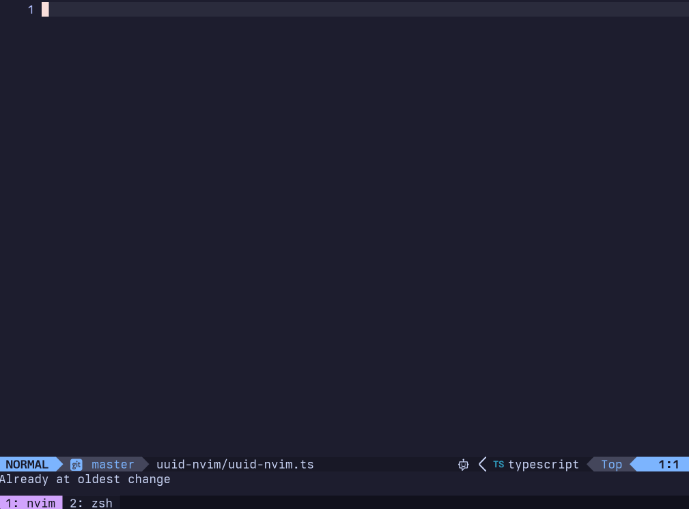

# uuid-nvim

`uuid-nvim` provides functions to generate, insert, and highlight V4 UUIDs in Neovim.



## Installation

If you are using the Lazy package manager, add the following configuration to your Lazy setup:

```lua
{
  'TrevorS/uuid-nvim',
  lazy = true,
  config = function()
    -- optional configuration
    require('uuid-nvim').setup{
      case = 'upper',
    }
  end,
}
```

If you are using Packer.nvim as your plugin manager, include the following line in your Packer configuration:

```lua
use 'TrevorS/uuid-nvim'

-- don't forget to call setup
require('uuid-nvim').setup{}
```

## Setup and Key Bindings

You can bind keys to toggle highlights and insert UUIDs:

```lua
local uuid = require('uuid-nvim')
uuid.setup{
  case = 'lower',
  quotes = 'single',
}

vim.keymap.set('n', '<leader>ut', uuid.toggle_highlight)
vim.keymap.set('i', '<C-u>', uuid.insert_v4)
```

## Note

`uuid-nvim` uses Lua's native random number generation for simplicity and portability. Lua's random number generator is not cryptographically secure and the generated UUIDs should not be used in security-sensitive contexts.

## Contributions

Feel free to open an issue or pull request if you find any bugs or have suggestions for improvements.
